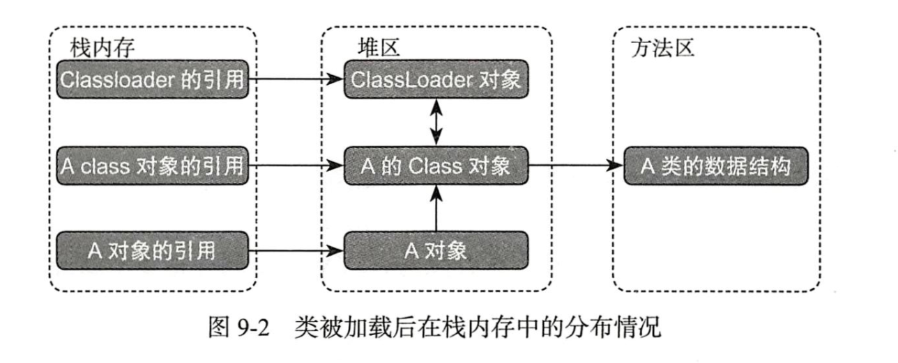

## 类加载
### 类加载简介
- 加载阶段：查找并且加载类的二进制数据文件（class 文件）
- 连接阶段：可以细分为三个阶段
    - 验证：主要是确保类文件的正确性，class 的版本，class 文件的魔数因子，他的作用就是 check 文件，确保class 对jvm 无安全影响。
    - 准备：为类的静态变量分配内存，并为其初始化默认值。
    - 解析：把类中的符号引用转化为直接引用。
- 初始化阶段：为类的静态变量赋予正确的初始值。

### 类的主动使用和被动使用
每个类或者接口被Java 程序首次主动使用时才会对其进行初始化，jvm 规范了6 中主动使用类的场景
1. 通过new 关键字会导致类的初始化。
2. 访问类的静态变量，包括读取和更新会导致类的初始化。
```java
public class Simple{  
    static {  
        System.out.println("i will be initialized");  
    }
    // 静态变量
    public static int x = 10;  
    
    // 静态方法
    public static void test(){  
      
    }
    // 反射初始化
    public static void main(String[] args) throws ClassNotFoundException{  
    Class.forName("com.frank.multihread.thread.Task");  
    }
}
```
这段代码直接访问变量 `x` 也会导致类的初始化。
3. 访问类的静态方法，会导致类的初始化。如上的 `test()` 方法
4. 对某个类进行反射操作，会导致类的初始化
5. 初始化子类会导致父类的初始化
```java
public class Parent {  
    static{  
        System.out.println("The parent is initialized");  
  }  
    public static int y = 100;  
}
public class Child extends Parent{  
    static{  
        System.out.println("the child will be initialized");  
  }  
    public static int x = 10;  
}
public class ActiveLoadTest {  
    public static void main(String[] args) {  
        System.out.println(Child.x);  
  }  
}
//--------------------------------------------------------------
//The parent is initialized
//the child will be initialized
//10

```
6. 启动类执行main 函数所在的类会导致初始化

#### 除了这六种情况，其余的都称为被动使用，不会导致类的加载和初始化
1. 构造某个类的数组时不会导致类的初始化，
```java
public class ActiveLoadTest {  
    public static void main(String[] args) {  
        Child[] children = new Child[10];  
         System.out.println(children.length);  
  }  
}
//--------------------------------------------------------------
//10    
```
此段代码只是开辟了一段连续的地址空间 `4byte * 10`
2. 引用类的静态常量不会导致类的初始化
```java
public class GlobalConstants {  
    static{  
        System.out.println("the GlobalConstants will be initialized.");  
  }  
  // 在其他类中使用MAX 不会导致 GlobalConstants 的初始化，静态代码块不会输出  
  public final static int MAX = 100;  
  
  // 此静态常量，使用 new 方法导致此类也被初始化  
  public final static Child child = new Child();  
}
public class ActiveLoadTest {  
    public static void main(String[] args) {  
        Child x = GlobalConstants.child;  
  }  
}
//--------------------------------------------------------------
//the GlobalConstants will be initialized.
//The parent is initialized
//the child will be initialized   
```

### 详解

```java
public class Singleton {  
      // 1  
      private static Singleton instance = new Singleton();  
  
      public static int x = 0;  
  
      public static int y;  
      // 2  
//    private static Singleton instance = new Singleton();  
  
      private Singleton(){  
            System.out.println("construct Singleton");  
            x++;  
            y++;  
      }  
      public static Singleton getInstance(){  
            System.out.println("static getInstance");  
            return instance;  
      }  
  
}

public class ActiveLoadTest {  
    public static void main(String[] args) {  
      System.out.println("begin exe main");  
      Singleton singleton = Singleton.getInstance();  
      System.out.println(singleton.x);  
      System.out.println(singleton.y);  
  }  
}
//--------------------------------------------------------------
//begin exe main
//construct Singleton
//static getInstance
//0
//1    
```
当将 instance 类变量的放在 2 出执行后输出会不一样

#### 类加载阶段
- 将class 文件中的二进制数据读取到内存中，然后将该字节 流锁代表的静态存储结构转换为方法区中运行时的数据结构，并且在堆内存中生成一个该类的 `java.lang.Class` 对象，作为访问方法区数据结构的入口。


- 类加载的最终产物是堆内存中的class 对象，对用一个classLoader 来讲，不管某个类被加载多少次，对应到堆内存中的class 对象始终是同一个。
- 类加载必须通过一个全限定名（包名+类名）获取二进制数据流，但是有很多获取方式。
    1. 运行时动态生成，动态代理 java.lang.Proxy 也可以生成代理类的二进制字节流
    2. 网络获取
    3. 读取 zip 文件，jar, war包
    4. 将类的二进制数据存储在数据库的 blob 字段类型中。
    5. 运行时生成class 文件，并且动态加载。

#### 连接阶段
- 验证
- 


