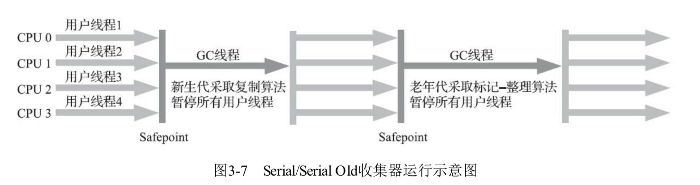
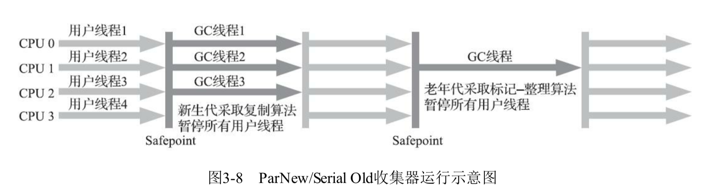
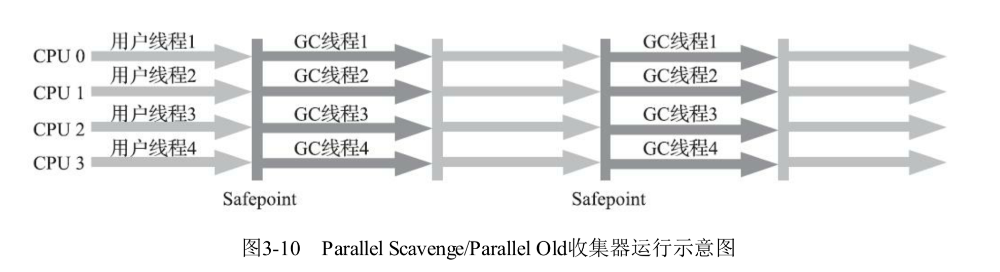

# 判断对象是否需要回收
### 引用计数算法
- 在对象中添加一个引用计数器，每当有一个地方引用它时，计数器加一；当引用失效时计数器值减一；
- 缺点：出现循环引用的情况导致对象不能被回收

### 可达性分析法
当前主流的商业程序语言（Java ，C#）的内存管理子系统，都是通过可达性分析算法来判断对象是否存活的。
- 通过一系列称为 `GC Roots` 的根对象作为起始节点集，这些节点开始，根据引用关系向下搜索，搜索过程所走过的路径称为“引用链” ，如果某个对象到GC Roots 间没有任何引用链相连，则证明此对象是不再被使用的。
- GC Roots 对象
    - 在虚拟机栈中引用的对象，譬如各个线程被调用的方法堆栈中使用到的参数，局部变量，零时变量；
    - 方法区中类静态属性引用的对象；
    - 方法区中常量引用的对象，譬如字符串常量池里的引用；
    - 虚拟机内部的引用，基本的数据类型对应的Class 对象，系统类加载器。
    - 被同步锁`synchronized` 持有的对象；

- 引用
    - 强引用
    - 软引用：系统将要发生内存溢出异常前，会把这些对象列进回收范围之中进行第二次回收。
    - 弱引用：被弱引用关联的对象只能生存到下一次垃圾收集发生为止。当垃圾收集器开始工作，无论当前内存是否足够，都会回收掉之内弱引用关联的对象。
    - 虚引用

# 垃圾收集算法
### 分代收集理论
两个分代假说之上：
- 弱引用假说：绝大数对象都是朝生夕死的。
- 强分代假说：熬过越多次垃圾收集过程的对象就越难以消亡。

add 假说：假如进行一次只局限于新生代区域内的收集（Minor GC）,但新生代中的对象完全有可能被老年代所引用，为了找出该区域中的存活对象，不得不在固定的GC Roots 之外，再额外遍历整个老年代中所有对象来确保可达性分析结果的正确性。遍历整个老年代对象理论上可行，但会为内存回收带来很大的性能负担。为了解决这个问题，需要对分代收集理论添加第三条经验法则：
- 跨代引用假说：垮代引用相对同代引用来说仅占极少数

这两个分代假说奠定了多款常用的垃圾收集器的一致设计原则：收集器应该将Java 堆划分出不同的区域，然后将回收对象一句年龄，分配到不同的区域之中存储。
所以采用了 `Minor GC, Major GC,Full GC` 这样的回收累心划分；

新生代收集：Minor GC/ Young GC ,指目标只是新生代的垃圾收集。
老年代收集：Major GC/ Old GC, 值目标只是老年代的垃圾收集。目前只有CMS 收集器会有单独收集老年代的行为。
混合收集：Mixed GC，指目标是收集整个新生代以及部分老年代的垃圾收集，目前只有G first 收集器有这种行为。
整堆收集：Full GC， 收集整个Java堆和方法区的垃圾收集

### 标记-清除算法
首先标记处所有需要回收的对象，标记完成后，统一回收掉所有被标记的对象。
缺点：
- 执行效率不稳定，如果堆中包含大量对象，其中大部分需要被回收，此时必须进行大量的标记和清除的动作，导致标记和清除两个过程的执行效率都岁对象的增长而降低。
- 内存空间的碎片化问题，标记清除后会产生大量的不连续的内存碎片，导致需要分配大对象时无法找到足够的连续内存而不得不提前出发另一次垃圾收集动作。

### 标记-复制算法
为了解决标记清除算法面对大量可回收对象时执行效率低的问题，提出一种称为“半区复制”的垃圾收集算法，将可用的内存分为大小相同的两块，每一次只使用其中一块，当使用的一块内存用完了，就将还存活的对象复制到另一块上面，然后把已使用过的内存空间一次清理掉。
- 由于新生代“朝生夕死” 的特点，按照 8：1：1 的内存划分为一块 Eden 区和两块 Survivor 区。
- 当垃圾回收是 Survivor 区不足以容纳 Minor GC 之后存活的对象时，就需要依赖其他内存区域（大多是老年代），进行分配担保。也就是说Survivor 区没有足够的空间放存活下来的对象时，这些对象便通过分配担保直接进入老年代中。

### 标记整理算法
- 标记复制算法在对象存活率较高时就要进行较多的复制操作，效率会降低。
- 让所有存活的对象都想内存空间的一端移动，然后直接清理掉边界以外的内存。
- 移动对象并更新所有引用这些对象的地方将会是一种极为负重的操作，而且这种对象移动操作必须全程暂停用户引用程序才能进行，这种停顿被最初的虚拟机设计者描述为“stop the world"
- 如果想标记-清除算法那样完全不考虑移动和整理存活对象的话，弥散于堆中的存活对象导致的空间碎片化问题只能依赖更为复杂的内存分配器和内存访问器来解决。譬如通过”分区空闲分配链表“来解决内存分配问题（计算机硬盘存储大文件就不要求物理连续的磁盘空间，能够在碎片化的硬盘上存储和访问就是通过银盘分区表实现的）
- 是否移动对象都会有弊端
    - 移动则内存回收时会更复杂，从整个程序的吞吐量来看，移动对象更为划算，
    - 不移动则内存分配是会更复杂，从垃圾停顿时间来看，不移动对象停顿时间会更短，甚至可以不需要停顿。
    - 即使不移动对象会使得收集器的效率提高一些，但因为 **内存分配和访问相比垃圾收集频率要高的多** ，这部分的耗时增加，总吞吐量任然是下降的。
    - 在HotSpot 虚拟机中关注吞吐量的 Parallel Scavenge收集器，是基于标记整理算法的，而关注延迟的 CMS 收集器则是基于标记清除算法的。

*** 
# 垃圾收集器
## 经典垃圾收集器

### Serial 收集器
- 单线程工作的收集器，它在进行垃圾回收集工作时，必须暂停其他所有工作线程，知道它收集结束。

- 简单高效，对于内存资源受限的环境，他是所有收集器里额外内存消耗最小的；

### ParNew 收集器
ParNew 收集器实质上是 Serial 收集器的多线程并行版本，处理同时使用多条线程进行垃圾收集之外，其余控制参数与Serial 收集器完全一致。

### Parallel Scavenge 收集器
新生代收集器

### Serial Old 收集器
Serial Old 收集器是 Serial 收集器的老年代版本，铜钥匙一个单线程收集器，使用标记-整理算法。

### Parallel Old 收集器

是Parallel Scavenge 收集器的老年代版本，支持多线程并发收集，基于标记-整理算法。
在注重吞吐量或者处理器资源较为稀缺的场合，都可以优先考虑 Parallel Scavenge 和 Parallel Old 收集器这个组合。

