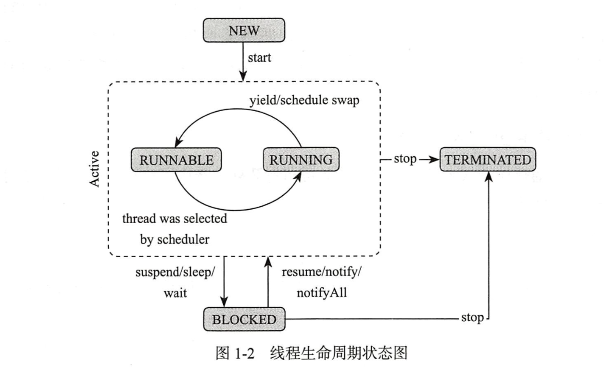
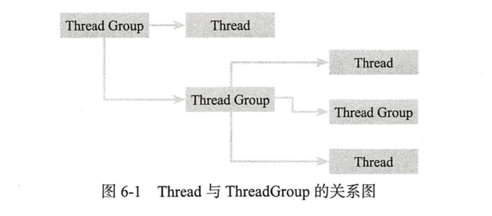

## Thread
### 线程简介
####  线程的生命周期


- NEW 状态
    - 用 new 关键字创建一个线程对象时，此时不处于执行状态，因为没有用start 方法启动线程，它只是一个Thread 对象。
    - 在没有start 之前改线程根本不存在，new状态进入runnable 状态
 
 - RUNNABLE 可执行状态
     - 线程进入 `RUNNABLE` 状态必须调用 `start` 方法，此时才是真正的在JVM 进程中创建一个线程
     - 此时具备执行资格，但是还在等待CPU 的调度
     - 严格莱索线程进入 `BLOCKED` 都是先获取CPU的调度，才能进入改状态。
 
 - RUNNING 状态
     - 可以进入如下状态转换
     - 进入 blocked 状态，比如调用sleep wait 方法。
     
- BLOCKED 状态
    - 线程完成了指定时间的休眠，进入runnable 状态
    - wait 中的线程被其他线程 notify 唤醒，进入runnable 状态
    - 线程获取某个锁资源，进入runnable 状态
- TERMINATED 状态
    - 此状态是一个最终态，改状态不会切换到其他任何状态，
    - 线程运行出错意外退出
    - JVM crash ，导致所有的线程都结束


#### start 方法
- Thread 被构造后的new 装填，ThreadStatus 这个内部属性为0。
- 不能两次启动Thread， 否则就会出现 IllegalThreadStateException 异常。
- 线程启动后就会被假如到一个 ThreadGroup 中。
- Thread 负责线程本身相关的职责和控制，Runnable 则负责逻辑执行单元的部分。

#### 线程的父子关系
``` java
private void init(ThreadGroup g, Runnable target, String name,  
 long stackSize, AccessControlContext acc,  
 boolean inheritThreadLocals) {  
    if (name == null) {  
        throw new NullPointerException("name cannot be null");  
  }  
  
    this.name = name;  
  
  Thread parent = currentThread();  
  SecurityManager security = System.getSecurityManager();
}

```
- 一个线程的创建肯定是由另一个线程完成的。
- 被创建线程的父线程是创建它的线程。
- main 线程是所有线程的父进程

#### Java 虚拟机栈
- 线程私有，他的生命周期与线程相同，在JVM 运行时所创建，在线程中方法在执行的时候都会创建一个栈帧，主要用于存放局部变量表，操作栈，动态链接，方法出口等信息，方法的调用对应着栈帧在虚拟机栈中的压栈和弹栈过程。
- 每个线程在创建的时候，JVM都会为其创建对应的虚拟机栈

#### 守护线程
- 守护线程是一类比较特殊的线程，一般用于处理一些后台工作，比如jdk 的垃圾回收线程。

---

## 线程安全与数据同步
在串行化的任务执行过程中，由于不存在资源的共享，线程安全的问题几乎不用考虑。

### 数据同步
- synchronized 
    - 提供一种锁机制，能够确保共享变量的互斥访问，从而防止数据不一致问题的出现。
    - `synchronized` 包含 `monitor enter` 和 `monitor exit` 两个 jvm 指令，能够保证在任何时候任何线程执行到 `monitor enter` 成功之前都必须从主内存中获取数据，而不是缓存中，在 `monitor exit` 运行后，共享变量的值必须刷入到主内存。
    - 严格遵守 `java heppens-before` 规则，一个 `monitor exit` 指令前必定有一个 `monitor enter`

```java
public class Mutex {  
  
    private final static Object MUTEX = new Object();  
  
 public void accessResource(){  
        synchronized (MUTEX){  
            try {  
                TimeUnit.MINUTES.sleep(10);  
  
  } catch (InterruptedException e){  
                e.printStackTrace();  
  }  
        }  
    }  
  
    public static void main(String[] args) {  
        final Mutex mutex = new Mutex();  
 for (int i = 0; i < 5; i++) {  
            new Thread(mutex::accessResource).start();  
  }  
    }  
}
```
`jstack -l pid`

``` 
"Thread-2" #12 prio=5 os_prio=31 tid=0x00007f9221974800 nid=0x3b03 waiting for monitor entry [0x0000700004ecc000]
   java.lang.Thread.State: BLOCKED (on object monitor)
	at com.frank.multihread.Mutex.accessResource(Mutex.java:20)
	- waiting to lock <0x000000076ad2ff48> (a java.lang.Object)
	at com.frank.multihread.Mutex$$Lambda$1/1775282465.run(Unknown Source)
	at java.lang.Thread.run(Thread.java:748)

   Locked ownable synchronizers:
	- None

"Thread-1" #11 prio=5 os_prio=31 tid=0x00007f92201af800 nid=0x4003 waiting for monitor entry [0x0000700004dc9000]
   java.lang.Thread.State: BLOCKED (on object monitor)
	at com.frank.multihread.Mutex.accessResource(Mutex.java:20)
	- waiting to lock <0x000000076ad2ff48> (a java.lang.Object)
	at com.frank.multihread.Mutex$$Lambda$1/1775282465.run(Unknown Source)
	at java.lang.Thread.run(Thread.java:748)

   Locked ownable synchronizers:
	- None

"Thread-0" #10 prio=5 os_prio=31 tid=0x00007f922019e800 nid=0x4103 waiting on condition [0x0000700004cc6000]
   java.lang.Thread.State: TIMED_WAITING (sleeping)
	at java.lang.Thread.sleep(Native Method)
	at java.lang.Thread.sleep(Thread.java:340)
	at java.util.concurrent.TimeUnit.sleep(TimeUnit.java:386)
	at com.frank.multihread.Mutex.accessResource(Mutex.java:20)
	- locked <0x000000076ad2ff48> (a java.lang.Object)
	at com.frank.multihread.Mutex$$Lambda$1/1775282465.run(Unknown Source)
	at java.lang.Thread.run(Thread.java:748)

   Locked ownable synchronizers:
	- None

```

### this monitor 和 class monitor

### 死锁检测
- 交叉锁引起的死锁
    - 交叉锁引起的死锁线程都会进入 BLOCKED 状态，CPU 资源占用不高，很容易借助工具发现
    - jstack -l pid
```bash
 frank@XYSZSX066  ~  jstack -l 93269 | grep -A 20  deadlock
Found one Java-level deadlock:
=============================
"WRITE-THREAD":
  waiting to lock monitor 0x00007fc46782bca8 (object 0x000000076ad30bf8, a java.lang.Object),
  which is held by "READ-THREAD"
"READ-THREAD":
  waiting to lock monitor 0x00007fc467a3ba08 (object 0x000000076ad30c08, a java.lang.Object),
  which is held by "WRITE-THREAD"

Java stack information for the threads listed above:
===================================================
"WRITE-THREAD":
	at com.frank.multihread.DeadLock.write(DeadLock.java:33)
	- waiting to lock <0x000000076ad30bf8> (a java.lang.Object)
	- locked <0x000000076ad30c08> (a java.lang.Object)
	at com.frank.multihread.DeadLock.lambda$main$1(DeadLock.java:50)
	at com.frank.multihread.DeadLock$$Lambda$2/1147985808.run(Unknown Source)
	at java.lang.Thread.run(Thread.java:748)
"READ-THREAD":
	at com.frank.multihread.DeadLock.read(DeadLock.java:22)
	- waiting to lock <0x000000076ad30c08> (a java.lang.Object)
--
Found 1 deadlock.
```

- 死循环引起的死锁（假死）
    - 严格意义上说死循环会导致程序假死，算不上真正的死锁，但是某个线程对 CPU 消耗过多，导致其他线程等待CPU，内存等资源也会陷入死锁等待。
    - 结合top——> jstack 命令使用

*** 

## 线程间通信
- 同步阻塞消息处理
- 异步非阻塞处理机制
    - 客户端提交  event 后会得到一个相应的工单并且立即返回。

### 单线程间通信
服务端有若干个线程会从队列中获取 相应的event 进行异步处理，那么这些线程有是如何从队列中获取数据的呢？通知机制：如果队列中有event，则通知工作的线程开始工作；没有event，则工作线程休息并等待通知。
#### wait 和 notify
- Object 中的方法，且必须拥有改对象的 monitor ，必须在同步方法中使用。
- 当线程执行了改对象的wait 方法之后，将会放弃对改 monitor 的所有权并且进入与该对象 关联的 wait set 中。
- wait 方法是可中断方法，当前线程一旦调用wait 方法进入阻塞状态，其他线程是可以使用 interrupt 方法将其打断的。
- 线程执行某个对象的wait 方法后，会假如到对应的 wai set 中，没有对象的monitor 都有一个与之关联的 wait set 

### wait 和 sleep 
- 都可以是线程进入阻塞状态
- 都是可中断方法
- wait 是object 的方法，sleep 是Thread 特有的方法
- wait 方法的执行必须在同步方法中进行，而sleep 则不需要
- 同步方法中执行 sleep 方法，不会释放 monitor 的锁，而wait 方法则会释放 monitor 的锁

## ThreadGroup 




## 线程池原理
线程是一个重量级的资源，创建，启动一级销毁都是比较耗费系统资源的。线程数量和系统性能是一种抛物线关系。


