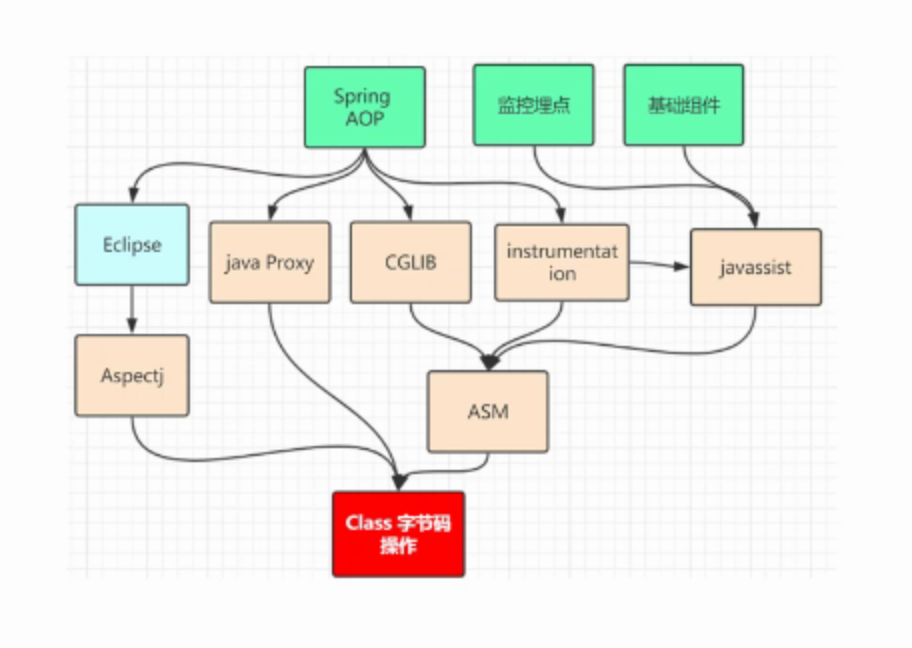

spring aop 中的实现方式
- jdk （动态构建字节码）动态代理 Java Proxy 动态构建全新字节码 bean 初始化的时候。必须使用反射，生成新的字节码文件class

- cglib （动态构建字节码）动态构建全新字节码 bean 初始化的时候。必须使用反射，生成新的字节码文件class
- AspectJ （修改目标类的字节，织入代理的字节，在程序编译时候插入动态代理的字节码，不会生成全新的Class）

都是通过字节码实现

