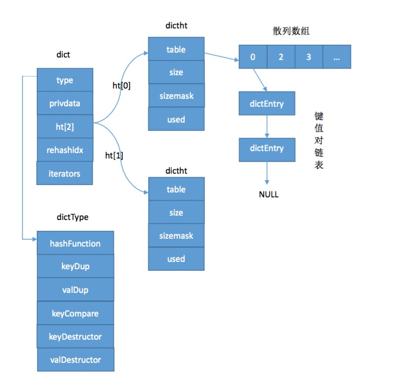

## redisObject
redis 的key-value 结构中的value 是一个redisObject 对象。实际存储类型由encoding 决定。
redisObject 占用16个字节
```
redisObject 对象：string ,list, set, zset, hash
typedef struct redisObject {

    // 类型
    unsigned type:4;

    // 编码
    unsigned encoding:4;

    // 对象最后一次被访问的时间
    unsigned lru:REDIS_LRU_BITS; /* lru time (relative to server.lruclock) */

    // 引用计数
    int refcount;

    // 指向实际值的指针
    void *ptr;

} robj;
```
redis 使用引用计数法管理内存
type :用来客户端约束api 使用的
encoding : redis 底层做的更进一步的优化，val 值的编码。
lru : 关于内存淘汰的
refcount：基于引用计数技术的内存回收机制，当程序不再使用某个对象的时候，这个对象所占用的内存就会被自动释放；另外redis 还通过引用技术实现了对象共享机制。
ptr : 真正指向数据的存储，在64位操作系统中占8字节 64位

help @string 查找所有对string 类型的api 操作

cpu cache line : 缓存行 64字节

bitmap:
setbit key offset 0/1  0(1)级别时间复杂度
offset :2^32 -1 四十多亿

- int: *ptr 直接存储了int 类型的数据。因为int 存储的值不会操作8个字节。
- embstr: cpu cache line : 缓存行 64字节: [redisObject:16字节 + sds:4字节 + 44字节] ，当存储的string 小于44字节时，直接开辟一个64字节的内存空间，将字符串和redisObject放到一起。不需要再进行一次内存io。


现有系统有亿级的活跃用户，如何实现日活统计，为了增强用户粘性，要上线一个连续打卡发送积分的功能，怎么实现连续打卡用户统计。

#### 不同类型和编码的对象
类型|	编码|	对象
---|---|---
String|	int|	整数值实现
String|	embstr|	sds实现 <=39 字节
String|	raw|	sds实现 > 39字节
List|	ziplist|	压缩列表实现
List|	linkedlist|	双端链表实现
Set|	intset|	整数集合使用
Set|	hashtable|	字典实现
Hash|	ziplist|	压缩列表实现
Hash|	hashtable|	字典使用
Sorted set|	ziplist|	压缩列表实现
Sorted set|	skiplist|	跳跃表和字典

#### 多态实现
对一个键执行llen 命令，那么服务器除了要确保执行的命令是列表键外。
1. 如果列表对象编码是 `ziplist` ，那么说明列表对象的实现为压缩列表，程序将使用`ziplist` 函数来返回列表的长度。
2. 如果列表对象的编码是 `linkedlist`，那么说明列表对象的实现是双端链表，程序将用 `linkedlist` 函数来返回双端链表的长度。

#### 内存回收
C语言不具备自动内存回收功能，redisObject 构建一个引用计数技术实现内存回收机制。
refcount ：
- 创建一个新对象时，引用计数值会被初始化为1
- 对象被一个新程序使用时，他的引用计数值会被增一
- 对象不再被一个程序使用时，他的引用计数值会被减一
- 当引用计数值为0 时，对象所占用的内存会被释放

#### 对象共享
redis 初始化服务器时，创建一万个字符串对象，包含0-9999的所有整数。

#### 过期键删除策略
redisDb 结构的 expires 字典保存了数据库中所有键的过期时间--过期字典。过期字典的val 是long 类型的整数存储过期时间。

1. 定时删除：创建一个定时器，让定时器在键的过期时间来临时，立即执行对键的删除操作。
2. 惰性删除：放任键过期不管，但是每次从空间中获取键时，都会检查取得的键是否过期，如果过期就删除该键；没有即返回；
3. 定期删除：每隔一段时间，程序对数据库进行一次检查，删除里面的过期键。

##### 定时删除
对cpu 时间不友好，过期键比较多的情况删除行为可能会占用相当一部分cpu 时间。
##### 惰性删除 
对CPU友好对内存不友好
##### 定期删除
每隔一段时间执行一次删除过期操作，并通过限制删除操作执行的时长和频率减少对CPU时间的影响。

### hashtable 字典使用

dict 结构体：
``` 
/* 字典的主操作类，对dictht结构再次包装  */
typedef struct dict {
    // 字典类型
    dictType *type;
    // 私有数据
    void *privdata;
    // 一个字典中有两个哈希表
    dictht ht[2];
    // 数据动态迁移的下标位置
    long rehashidx; 
    // 当前正在使用的迭代器的数量
    int iterators; 
} dict;

```

dictht结构体:
```
/* 哈希表结构 */
typedef struct dictht {
    // 散列数组。
    dictEntry **table;
    // 散列数组的长度
    unsigned long size;
    // sizemask等于size减1
    unsigned long sizemask;
    // 散列数组中已经被使用的节点数量
    unsigned long used;
} dictht;

```

dictType结构体:
```
/* 定义了字典操作的公共方法，类似于adlist.h文件中list的定义，将对节点的公共操作方法统一定义。搞不明白为什么要命名为dictType */
typedef struct dictType {
    /* hash方法，根据关键字计算哈希值 */
    unsigned int (*hashFunction)(const void *key);
    /* 复制key */
    void *(*keyDup)(void *privdata, const void *key);
    /* 复制value */
    void *(*valDup)(void *privdata, const void *obj);
    /* 关键字比较方法 */
    int (*keyCompare)(void *privdata, const void *key1, const void *key2);
    /* 销毁key */
    void (*keyDestructor)(void *privdata, void *key);
    /* 销毁value */
    void (*valDestructor)(void *privdata, void *obj);
} dictType;

```

dictEntry结构体:
```
/* 保存键值（key - value）对的结构体，类似于STL的pair。*/
typedef struct dictEntry {
    // 关键字key定义
    void *key;  
    // 值value定义，只能存放一个被选中的成员
    union {
        void *val;      
        uint64_t u64;   
        int64_t s64;    
        double d;       
    } v;
    // 指向下一个键值对节点
    struct dictEntry *next;
} dictEntry;

```

四个结构体之间关系:


#### 哈希算法

#### 解决键冲突
链地址法，程序总是将新节点添加到链表的表头节点位置（复杂度为O(1)）,排在其他已有节点的前面。

#### rehash
1. 为字典的ht[1] 哈希表分配空间，这个哈希表的空间大小取决于要执行的操作，以及ht[0]当前包含的键值对数量：
2. 如果是扩展操作，那么ht[1] 的大小为ht[0] 的一倍
3. 如果是收缩操作，那么ht[1] 的大小为ht[0] 的一半
4. 将保存在ht[0] 中的所有键值对rehash 到 ht[1] 中，rehash 是重新计算键的哈希值和索引值，然后将键值对放到ht[1]哈希表的指定位置上。
5. 当ht[0] 包含的所有键值对都迁移到ht[1] 之后，释放ht[0],将ht[1]设置为ht[0],并在ht[1]新创建一个空白的哈希表，为下一次rehash 准备。

#### 扩展与收缩
服务器没有执行 BGSAVE 命令或者 BGREWRITEAOF, 并且负载因子大于等于1 
服务器正在执行 BGSAVE 命令或者 BGREWRITEAOF, 并且负载因子大于等于5

负载因子 = 哈希表已保存节点数量/哈希表大小

#### 渐进式hash 
1. 为ht[1] 分配空间，让字典同时持有ht[0] 和 ht[1] 两个哈希表
2. 在字典中维持一个索引计数器变量 rehashindx,并将他的值设置为0，表示rehash 正式开始。
3. 在rehash 进行期间，每次对字典执行添加，删除，查找或者更新操作时，程序除了执行指定的操作外，还会顺带将ht[0]哈希表在rehashidx索引上的所有键值对rehash到htp[1],当rehash工作完成之后，程序将rehashidx属性增加一。
4. 随着字典的操作不断执行，最终ht[0]的所有键值对都会被rehash到ht[1]，这时将 rehashidx 设置为-1，表示rehash操作完成。

##### 哈希表操作
字典的删除，查找，更新邓操作会在两个哈希表上。添加到字典的键值一律会被保存到ht[1]里面。