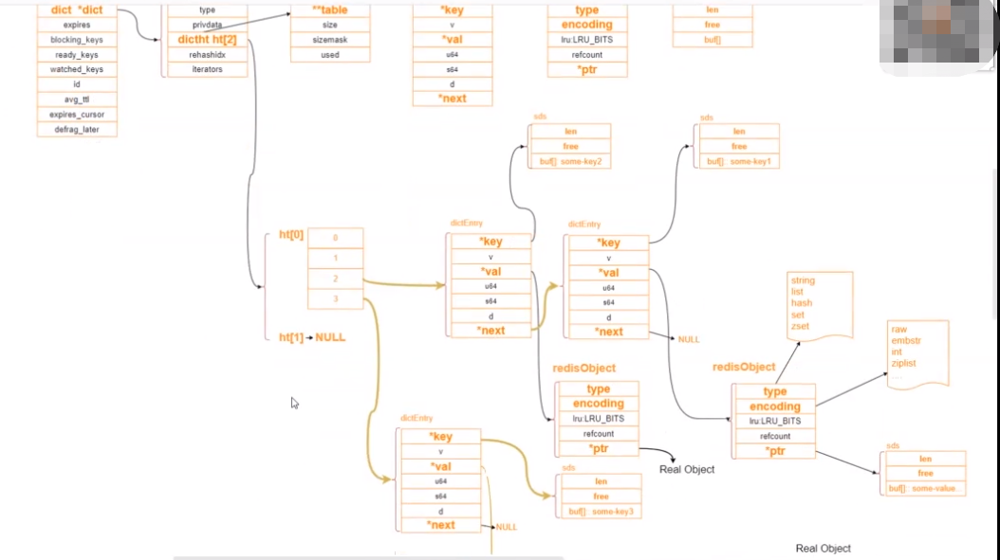
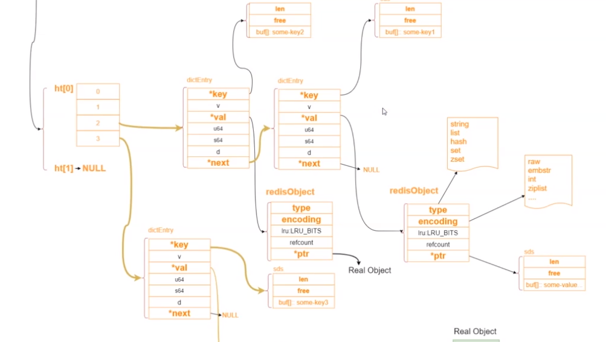
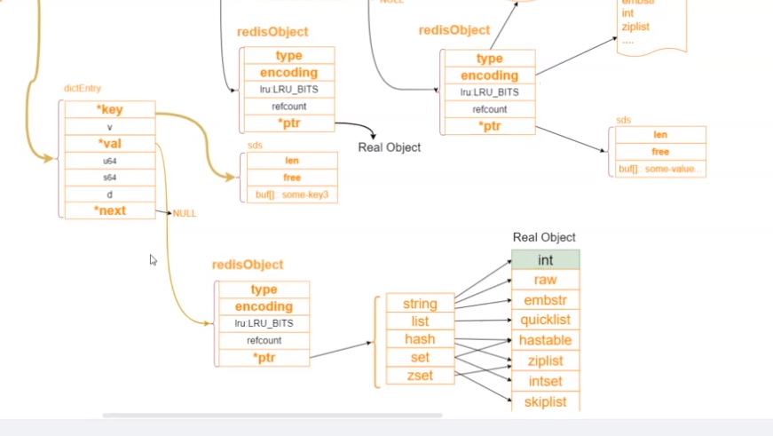

## redisObject
redis 的key-value 结构中的value 是一个redisObject 对象。实际存储类型由encoding 决定。
redisObject 占用16个字节
```
redisObject 对象：string ,list, set, zset, hash
typedef struct redisObject {

    // 类型
    unsigned type:4;

    // 编码
    unsigned encoding:4;

    // 对象最后一次被访问的时间
    unsigned lru:REDIS_LRU_BITS; /* lru time (relative to server.lruclock) */

    // 引用计数
    int refcount;

    // 指向实际值的指针
    void *ptr;

} robj;
```
redis 使用引用计数法管理内存
type :用来客户端约束api 使用的
encoding : redis 底层做的更进一步的优化，val 值的编码。
lru : 关于内存淘汰的
ptr : 真正指向数据的存储，在64位操作系统中占8字节 64位

help @string 查找所有对string 类型的api 操作

cpu cache line : 缓存行 64字节

bitmap:
setbit key offset 0/1  0(1)级别时间复杂度
offset :2^32 -1 四十多亿

- int: *ptr 直接存储了int 类型的数据。因为int 存储的值不会操作8个字节。
- embstr: cpu cache line : 缓存行 64字节: [redisObject:16字节 + sds:4字节 + 44字节] ，当存储的string 小于44字节时，直接开辟一个64字节的内存空间，将字符串和redisObject放到一起。不需要再进行一次内存io。


现有系统有亿级的活跃用户，如何实现日活统计，为了增强用户粘性，要上线一个连续打卡发送积分的功能，怎么实现连续打卡用户统计。