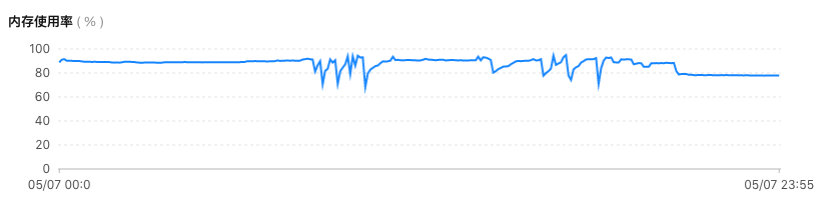

1. 首先排查机器是否重启
- uptime

```
[user_00@VM_1_3_centos ~]$ uptime
 10:45:40 up 215 days, 18:55,  2 users,  load average: 1.62, 2.19, 1.60
```
```
15:31:30  系统当前时间 
up 127 days, 3:00 主机已运行时间,时间越大，说明你的机器越稳定。  
1 user  用户连接数，是总连接数而不是用户数 
load average: 0.00, 0.00, 0.00   系统平均负载，统计最近1，5，15分钟的系统平均负载
```
 2. 程序有bug 自动重启
 查看 error.log

3. 被系统干掉

### linux的OOM killer

Linux 内核有个机制叫OOM killer（Out-Of-Memory killer），该机制会监控那些占用内存过大，尤其是瞬间很快消耗大量内存的进程，为了防止内存耗尽而内核会把该进程杀掉。  
因此，你发现java进程突然没了，首先要怀疑是不是被linux的OOM killer给干掉了！  
你可以去下面这个文件里翻

* 系统报错日志:`/var/log/messages`

执行命令

    egrep -i 'killed process' /var/log/messages
    

去日志里进行查询。  
当然，你也可以去内核日志里头查询。有时Linux系统或者系统上运行的java或者其它进程，会发生一些莫名其妙的问题，比如突然挂掉了，比如突然重启等等。在软件上找不到问题所在，此时我们应该怀疑硬件或者内核的问题，此时我们就可以使用 dmesg来查看：

    dmesg | grep java
    

输出如下

```  
[58114225.389246] Out of memory: Kill process 30138 (java) score 233 or sacrifice child
[58114225.391895] Killed process 30138 (java) total-vm:11504392kB, anon-rss:1850976kB, file-rss:552kB, shmem-rss:0kB
[58115546.577532] [11717]  1000 11717  1062223   117052     336        0             0 java
[58115546.577535] [22917]  1000 22917  1066289   214304     524        0             0 java
[58115546.577558] [ 4065]  1000  4065  1094763   137709     456        0             0 java
[58115546.577565] [ 1521]  1000  1521   987136   149965     411        0             0 java
[58115546.577568] [26418]  1000 26418  1094057   227357     621        0             0 java
[58115546.577573] [15953]  1000 15953  2101668   461954    3282        0             0 java
[58115546.577575] Out of memory: Kill process 15953 (java) score 232 or sacrifice child
[58115546.580476] Killed process 15953 (java) total-vm:8406672kB, anon-rss:1847416kB, file-rss:400kB, shmem-rss:0kB
[58130610.591722] [11717]  1000 11717  1062223   117052     336        0             0 java
[58130610.591725] [22917]  1000 22917  1066289   214304     524        0             0 java
[58130610.591745] [ 4065]  1000  4065  1094763   137709     456        0             0 java
[58130610.591751] [ 1521]  1000  1521   987136   149874     411        0             0 java
[58130610.591754] [26418]  1000 26418  1094058   227386     621        0             0 java
[58130610.591757] [ 6257]  1000  6257  1901125   455254    2711        0             0 java
[58130610.591769] Out of memory: Kill process 6257 (java) score 228 or sacrifice child
[58130610.594781] Killed process 6257 (java) total-vm:7604500kB, anon-rss:1820872kB, file-rss:108kB, shmem-rss:0kB
[58136732.696940] [11717]  1000 11717  1062223   117053     336        0             0 java
[58136732.696943] [22917]  1000 22917  1066289   214309     524        0             0 java
[58136732.696964] [ 4065]  1000  4065  1094763   137716     456        0             0 java
[58136732.696970] [ 1521]  1000  1521   987136   149903     411        0             0 java
[58136732.696972] [26418]  1000 26418  1094062   227399     621        0             0 java
[58136732.696976] [24648]  1000 24648  1885029   440665    2263        0             0 java
[58136732.696999] Out of memory: Kill process 24648 (java) score 221 or sacrifice child
[58136732.700485] Killed process 24648 (java) total-vm:7540116kB, anon-rss:1762660kB, file-rss:0kB, shmem-rss:0kB
[58139795.291102] [11717]  1000 11717  1062223   117053     336        0             0 java
[58139795.291105] [22917]  1000 22917  1066289   214351     524        0             0 java
[58139795.291127] [ 4065]  1000  4065  1094763   137747     456        0             0 java
[58139795.291133] [ 1521]  1000  1521   987136   149993     411        0             0 java
[58139795.291136] [26418]  1000 26418  1094057   227411     621        0             0 java
[58139795.291140] [14390]  1000 14390  1852277   353866    2000        0             0 java
[58139795.291261] Out of memory: Kill process 14390 (java) score 177 or sacrifice child
[58139795.294337] Killed process 14390 (java) total-vm:7409108kB, anon-rss:1415464kB, file-rss:0kB, shmem-rss:0kB
[58143334.730476] [11717]  1000 11717  1062223   117053     336        0             0 java
[58143334.730479] [22917]  1000 22917  1066289   214351     524        0             0 java
[58143334.730495] [ 4065]  1000  4065  1094763   137755     456        0             0 java
[58143334.730499] [ 1521]  1000  1521   987136   150018     411        0             0 java
[58143334.730501] [26418]  1000 26418  1107935   227683     655        0             0 java
[58143334.730566] [ 9065]  1000  9065  1888382   365423    2166        0             0 java
[58143334.730583] Out of memory: Kill process 9065 (java) score 183 or sacrifice child
[58143334.733547] Killed process 9065 (java) total-vm:7553528kB, anon-rss:1461072kB, file-rss:620kB, shmem-rss:0kB
```
当天的内存监控：



查看gc 的命令
``` 
 2268  2021-05-07 15:51:08 jstat -gc 24648 3000
 2273  2021-05-07 15:53:08 jstat -gc 4065 3000
 2274  2021-05-07 15:53:33 jstat -gc 26418 3000
 2287  2021-05-07 16:08:16 jstat -gcutil 14390 1000
 2289  2021-05-07 16:09:46 jstat -gc 14390 1000
 2290  2021-05-07 16:10:28 jstat -gc 14390 1000 10
 2301  2021-05-07 16:16:21 jstat -gcutil 14390
 2303  2021-05-07 16:16:55 jstat -gcutil 14390
 2305  2021-05-07 16:20:00 jstat -gc 14390 1000 10
 2306  2021-05-07 16:17:24 jstat -gcutil 14390 1000
 2307  2021-05-07 16:21:18 jstat -gc 14390 1000 10
 2330  2021-05-07 16:36:48 jstat -gc 14390 3000
 2378  2021-05-07 17:06:41 jstat -gc 9065 1000
 2410  2021-05-07 17:16:56 jstat -gcmetacapacity 90645
 2439  2021-05-07 17:19:34 jstat -gc 9065 10000
 2440  2021-05-07 17:26:10 jstat -gcutil 9065
 2467  2021-05-07 17:32:46 jstat -gc 9065 10000
 2477  2021-05-07 17:34:45 jstat -gc 9065 5000
 2499  2021-05-07 17:39:16 jstat -gcutil 9065
 2502  2021-05-07 17:39:19 jstat -gcutil 9065 3s
 2540  2021-05-07 17:57:00 jstat 26418
 2543  2021-05-07 17:57:21 jstat -gc 9065 5000
 2549  2021-05-07 17:58:56 jstat gcutil 5391
 2558  2021-05-07 18:00:57 jstat -gc 5391 10s
```

完全是可以看到内核对进程做对操作。

- 通过迁移此台机器中的一个服务释放内存。

### 解决

1，限制java进程的max heap，并且降低java程序的worker数量，从而降低内存使用

2，发现系统没有开启swap，给系统加了8G的swap空间
