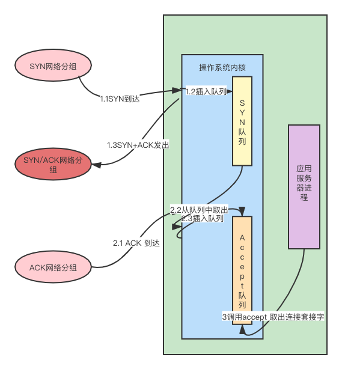

## tcp 三次握手
### tcp accept

- 两个队列是内核实现，当服务器绑定，监听了某个端口后，这个端口的 SYN队列和Accept 队列就建立好了。
- SYN队列（半连接队列），

- 为何有的应用服务器进程中，会单独使用一个线程，只调取accept方法来建立连接，例如：tomcat; 有的应用服务器进程中却用一个线程做所有的事，
包括accept 获取新连接。

原因在于：首先，SYN 队列和 ACCEPT 队列长度都是有限的，当插入SYN 队列速度大于取出队列时，会不断增大知道达到队列满；
当取出ACCEPT 队列速度小于插入队列时 ACCEPT队列时也会满。当两个队列满了后，就会使得客户端不能再建立新连接，引发严重问题。
- 所以 TOMCAT 等服务器使用独立的线程，只做accept 获取连接这一件事，以防止不能及时去。
- 为什么有些如Nginx 服务器，可以一个线程内做 accept 的同时，还会做其他IO 操作呢？

### tcp send
通常调用send 或者 write 方法发送数据到另一台主机，那么调用这样的方法时，在操作系统内核中发生什么事呢？
1. 发送方法成功返回时，能保证 TCP 另一端的主机接收到吗？
2. 能保证数据已经发送到网络上吗?
3. 套接字为阻塞或非阻塞时，发送方法做的事有何不同？

MTU， MSS，tcp_write_queue 发送队列，阻塞与非阻塞套接字，拥塞窗口，滑动窗口，Nagle 算法

- MSS 与 TCP 分片
IP 包的总长度是一个16位 2 字节的字段，也就是一个IP包最大可以是 65535 字节。
若TCP层在以太网总试图发送一个大于 1500 字节的消息，调用IP 网络层发送消息时，IP 层会自动获取所在局域网的MTU 值，并按照所在网络的MTU 大小分片。
IP包同时希望这个分片对于 传输层来说是透明的，接收方的IP 这种IP层的分片效率是很差的，因为必须所有分片都能到达才能重组一个包，其中任何一个分片丢失了，都必须重发所有分片。
所以TCP 层会试图避免IP 层执行数据包分片。
为了避免 IP层的分片，TCP 协议定义了一个新的概念： 最大报文段长度MSS，

- 发送方法成功返回时，能保证 TCP 另一端的主机接收到吗？
不是，

- nagle 算法
要求一个tcp 连接上最多只能由一个发送出去还没被确认的小分组，在改分组的确认到达之前不能发送其他的小分组。

