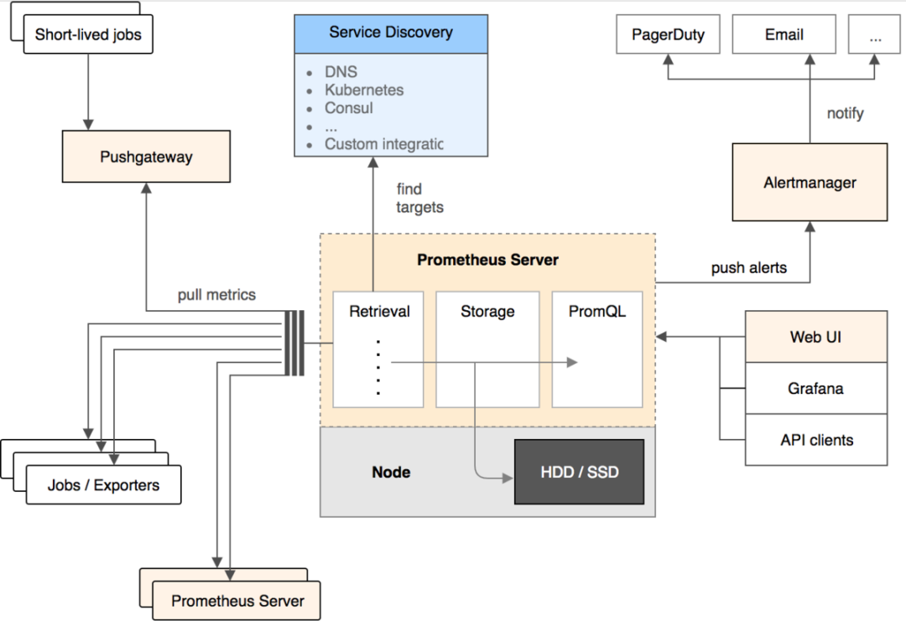

Prometheus 2016年加入云原生基金会，是继k8s后托管的第二个项目，未来前景被相当看好。它和Open-Falcon最大不同在于：数据采集是基于Pull模式的，而不是Push模式，并且架构非常简单。

- Prometheus Server：核心组件，用于收集、存储监控数据。它同时支持静态配置和通过Service Discovery动态发现来管理监控目标，并从监控目标中获取数据。此外，Prometheus Server 也是一个时序数据库，它将监控数据保存在本地磁盘中，并对外提供自定义的 PromQL 语言实现对数据的查询和分析。
- Exporter：用来采集数据，作用类似于agent，区别在于Prometheus是基于Pull方式拉取采集数据的，因此，Exporter通过HTTP服务的形式将监控数据按照标准格式暴露给Prometheus Server，社区中已经有大量现成的Exporter可以直接使用，用户也可以使用各种语言的client library自定义实现。
- Push gateway：主要用于瞬时任务的场景，防止Prometheus Server来pull数据之前此类Short-lived jobs就已经执行完毕了，因此job可以采用push的方式将监控数据主动汇报给Push gateway缓存起来进行中转。
- Alert Manager：当告警产生时，Prometheus Server将告警信息推送给Alert Manager，由它发送告警信息给接收方。
- Web UI：Prometheus内置了一个简单的web控制台，可以查询配置信息和指标等，而实际应用中我们通常会将Prometheus作为Grafana的数据源，创建仪表盘以及查看指标。

下面是Prometheus的优势：

- 轻量管理：架构简单，不依赖外部存储，单个服务器节点可直接工作，二进制文件启动即可，属于轻量级的Server，便于迁移和维护。
- 较强的处理能力：监控数据直接存储在Prometheus Server本地的时序数据库中，单个实例可以处理数百万的metrics。
- 灵活的数据模型：同Open-Falcon，引入了tag，属于多维数据模型，聚合统计更方便。
- 强大的查询语句：PromQL允许在同一个查询语句中，对多个metrics进行加法、连接和取分位值等操作。
- 很好地支持云环境：能自动发现容器，同时k8s和etcd等项目都提供了对Prometheus的原生支持，是目前容器监控最流行的方案。

下面是Prometheus的劣势：

- 功能不够完善：Prometheus从一开始的架构设计就是要做到简单，不提供集群化方案，长期的持久化存储和用户管理，而这些是企业变大后所必须的特性，目前要做到这些只能在Prometheus之上进行扩展。
- 网络规划变复杂：由于Prometheus采用的是Pull模型拉取数据，意味着所有被监控的endpoint必须是可达的，需要合理规划网络的安全配置。

### 时序数据库：
- 规模

时间数据的特点是累计速度非常快，常规数据库在设计之初，并非是为了处理这种规模的数据，而且关系型数据库在处理大规模的数据集的效果非常差。

- 使用特性

时序数据库能够提供一些通用的对时间序列数据分析的功能和操作，比如数据保留策略、连续查询、灵活的时间聚合，此外时序数据库以时间为维度，也提供更快的大规模查询、更好的数据压缩等。

#### 数据结构
##### LSM 
log Structured Merge Trees 通过 减少本机更新操作来达到更好的写操作和吞吐量

影响写操作吞吐量的主要原因还是磁盘的随机操作慢，顺序读写快，解决办法是将文件的随机存储改为顺序存储，因为完全是顺序的，提升写操作性能，比如日志文件就是顺序写入。
LSM 是将之前使用的一个大的查找结构（造成随机读写，影响写性能的结构，比如 B+ 树），变换为将写操作顺序的保存到有序文件中，且每个文件只保存短时间内的改动。文件是有序的，所以读取的时候，查找会非常快 。且文件不可修改，新的更新操作只会写入到新的文件中。读操作检查有序的文件。然后周期性的合并文件来减少文件的个数。

写入操作

数据先在内存中缓存（memtable) 中，memtable 使用树的结构来保持 key 是有序的，同时使用 WAL 的方式备份数据到磁盘。当 memtable 中数据达到一定规模后会刷新数据到磁盘生成文件。

更新写入操作

文件不允许被编辑，所以新的内容或修改只是简单的生成新的文件。当越多的数据存储到系统中，就会有越多的不可修改、顺序的有序文件被创建。但比较旧的文件不会被更新，重复的激流只会通过创建新的记录来达到覆盖的目的，但这这就产生了冗余的数据。

系统会周期性的执行合并的操作，合并操作用于移除重复的更新或者删除记录，同时还能够减少文件个数的增加，保证读操作的性能。

读取操作

查询的时候首先检查内存数据（memtable)，如果没有找到这个 key，就会逆序的一个个的检查磁盘上的文件，但读操作耗时会随着磁盘上文件个数的增加而增加。（O(K log N), K为文件个数， N 为文件平均大小）。可以使用如下策略减少耗时

将文件按照 LRU 缓存到内存中
周期性的合并文件，减少文件的个数
使用布隆过滤器避免大量的读文件操作（如果bloom说一个key不存在，就一定不存在，而当bloom说一个文件存在是，可能是不存在的，只是通过概率来保证）

[from](https://www.cnblogs.com/jpfss/p/12183214.html)